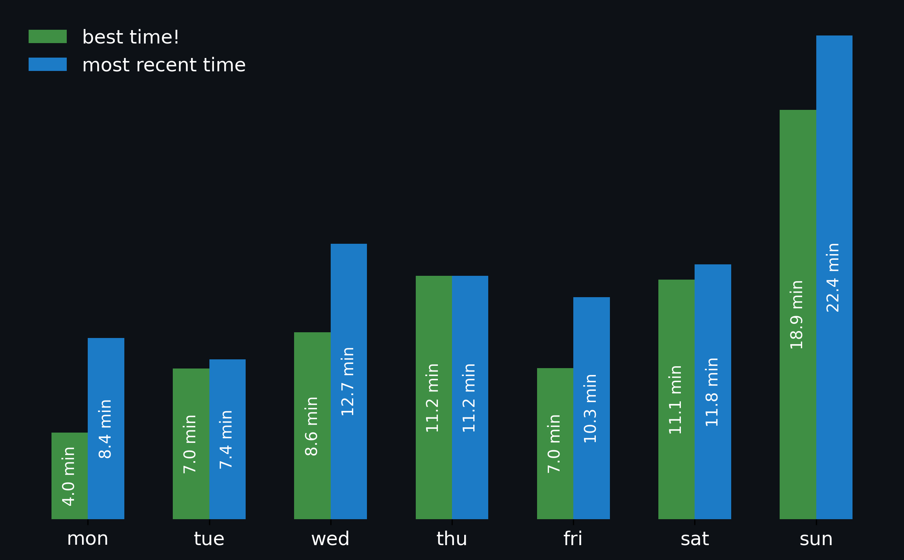

# widget that displays NYT crossword stats to profile README

<!-- START NYT-STATS -->
## NYT Crossword Stats
**Puzzles solved:** 90

Haven't done the crossword today yet!

<!-- END NYT-STATS -->

## Set up scraping
1. log in, go to 'my stats', and open inspect
2. go to the Network tab and search 'json', then refresh the page
3. a file called 'stats-and-streaks' should show up 
4. copy the url under summary and replace value in fetch_stats.py

## Configure GitHub token
- go into this repository's settings -> actions -> general and change workflow permissions to read and write so the cron job can make commits

## Change repository location in update-stats.yml
- under 'commit and push changes' change the respository url

i forgot what other things you might need to change -- will update later